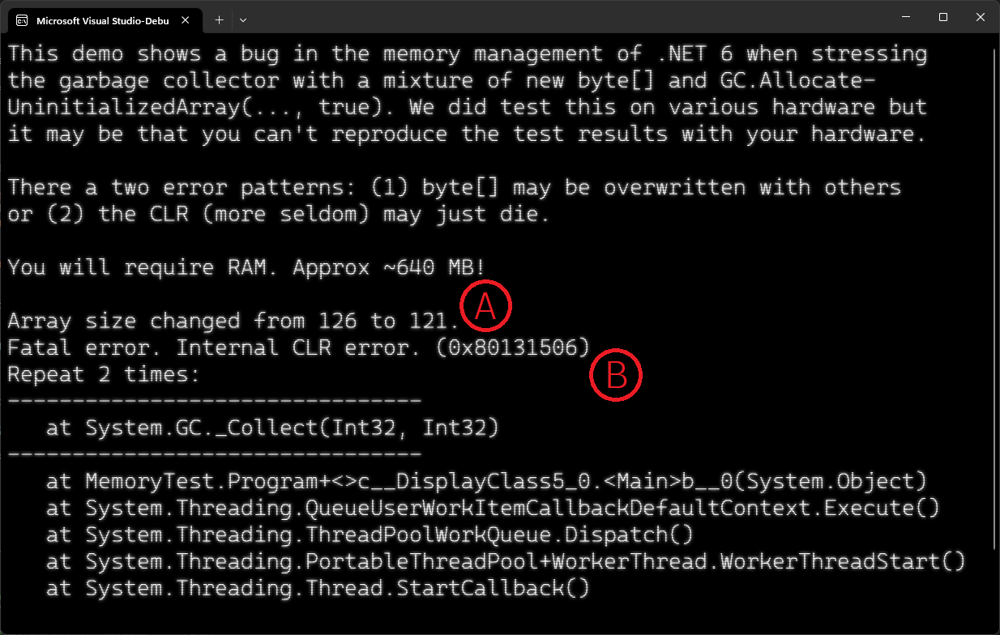

# Bug in .NET 6 CLR (and .NET 7).
There is (propably) a bug in the .NET 6 (and 7) runtime as of 6.0.14 and 7.0.3. You can follow [issue 82548 in dotnet/runtime](https://github.com/dotnet/runtime/issues/82548).
When using multiple threads to create `byte[]` (and propably other datatypes as well) via `new byte[n]` and `GC.AllocateUninitializedArray(n, true)` the memory (quite often) gets corrupted. This usually leads to one of the following outcomes:
1. The CLR crashes with `Fatal error. Internal CLR error. (0x80131506)`. Sometimes it also can print out a stacktrace for `System.GC._Collect(int, int)`.
1. Previously initialized `byte[]`s get overwritten and sometimes also data within those `byte[]`s seem to get overwritten with some kind of control structure of the garbage collector.
# How to reproduce this bug.
1. Checkout the project and run it. :)
Due to the randomness and the non deterministic behavior of this test case multiple starts of the software may be required. We observed that in most cases the first appearances of this issue happen within the first 5 to 10 seconds. __It also may make a difference if your hardware doesn't support all the threads we are starting.__ (You can try to adjust the settings for your hardware.)
# Error cases explained.

Case A shows the issue detected by our demo program: A `byte[]` (see `Mem.cs`, line `14`) has changed its size even though the corresponding `byte[]` is `public readonly` (see `Mem.cs`, line `5`).
Case B show the crash of the CLR and also the mentioned stacktrace for the garbage collector run:
```text
Fatal error. Internal CLR error. (0x80131506)
Repeat 2 times:
--------------------------------
   at System.GC._Collect(Int32, Int32)
--------------------------------
   at MemoryTest.Program+<>c__DisplayClass5_0.<Main>b__0(System.Object)
   at System.Threading.QueueUserWorkItemCallbackDefaultContext.Execute()
   at System.Threading.ThreadPoolWorkQueue.Dispatch()
   at System.Threading.PortableThreadPool+WorkerThread.WorkerThreadStart()
   at System.Threading.Thread.StartCallback()
```
